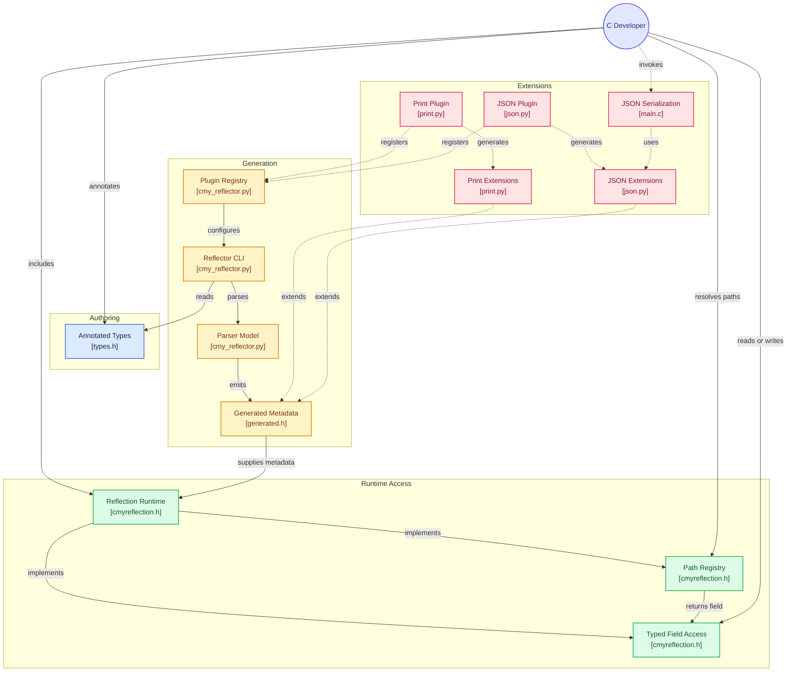

# CMyReflection


A simple reflection framework for C99+

## Features
- **Registry** Look up nested structures through paths (gdb-like) `"my_struct_arr[2].x"`
- **Optional Automatic code generation** with `cmy_reflector.py` that automatically parses annotations
- **Single Header** (`cmyreflection.h`)
- **Plugin System**
- **Type Safety** Compile time definitions are created for runtime safety
- **Zero Allocation** Strictly uses stack or in-place objects

## Dependencies
- C99+ compiler
- (Optional) python3 (Required for plugins and automatic code generation support)

## Usage
### 1. Annotate Structs & Enums
```c
// cmy:reflect
typedef struct
{
    float voltage;
    float temp;
} SensorData;

// cmy:reflect
typedef enum
{
    DEVICE_RX,
    DEVICE_TX,
} DeviceState;

// cmy:reflect
typedef struct
{
    char        device_id[32];
    int         baud_rate;
    SensorData  data;
    DeviceState state;

    // cmy:readonly
    uint64_t uuid;
} IoTDevice;

// cmy:reflect
// cmy:unchecked
typedef enum
{
    MANAGER_NONE  = 1 << 0,
    MANAGER_READ  = 1 << 1,
    MANAGER_WRITE = 1 << 2,
} ManagerPermissions;

#define MAX_BUF_LEN 64

// cmy:reflect
typedef struct
{
    unsigned char      op_mode;

    // cmy:readonly
    ManagerPermissions permissions;

    char               device_location[MAX_BUF_LEN];
    IoTDevice          devices[8];
} DeviceManager;
```

### 2. Generate Reflection Data
```sh
# Recursively finds all *.h and *.c files in ./src
python cmy_reflector.py -i ./src/ -o reflection.generated.h
```

### 3. Use in C Code
```c
#define CMYREFLECTION_IMPLEMENTATION // Defines the CMyReflection implementation
#define REFLECTION_IMPLEMENTATION // Defines the implementation for the generated header
#include "reflection.generated.h"

// ...
DeviceManager manager = {0};

const StructFieldInfo *leaf   = NULL;
void            *target = resolve_field_path(&manager,
                                  DeviceManager_Metadata,
                                  DeviceManager_FieldCount,
                                  "devices[2].data.voltage",
                                  &leaf);

if (target && leaf)
{
    // Safely inject data to manager->devices[2].data.voltage
    set_field_float(target, leaf, 240.5f);
}

const StructFieldInfo *location_field =
    find_field(DeviceManager_Metadata, DeviceManager_FieldCount, "device_location");
char *location = "bedroom1";

if (set_field_str(&manager, location_field, location) != REFLECT_OK)
{
    printf("Oops, forget that its a char arr!\n");

    // Ensures that the array has enough size to store the new string
    set_field_char_arr(&manager, location_field, location, strlen(location));
}
```

## CMake Integration
```cmake
include(FetchContent)

# Declare and download CMyReflection
FetchContent_Declare(
    cmyreflection
    GIT_REPOSITORY https://github.com/oonamo/CMyReflection.git
    GIT_TAG        main
)
FetchContent_MakeAvailable(cmyreflection)

# Set the Python Script Path
set(CMY_GENERATOR_SCRIPT "${cmyreflection_SOURCE_DIR}/cmy_reflector.py")

# Track reflection related files
file(GLOB_RECURSE REFLECTION_SRC_FILES CONFIGURE_DEPENDS "${PROJECT_SOURCE_DIR}/include/*.h")
file(GLOB_RECURSE MY_PLUGIN_FILES CONFIGURE_DEPENDS "${PROJECT_SOURCE_DIR}/plugins/*.py")

# Set Reflection Output
set(REFLECTION_OUTPUT "${PROJECT_SOURCE_DIR}/reflection.generated.h")

# Ignore reflection file (Prevents CMake from rebuilding if file is generated with no changes)
list(REMOVE_ITEM REFLECTION_SRC_FILES "${REFLECTION_OUTPUT}")

find_package(Python3 REQUIRED COMPONENTS Interpreter)

# Run cmyreflection script when needed
add_custom_command(
    OUTPUT  "${REFLECTION_OUTPUT}"
    COMMAND Python3::Interpreter "${CMY_GENERATOR_SCRIPT}"
            --input ${REFLECTION_SRC_FILES}
            --output ${REFLECTION_OUTPUT}
            --plugins "${cmyreflection_SOURCE_DIR}/plugins/print.py" ${MY_PLUGIN_FILES}
    DEPENDS "${CMY_GENERATOR_SCRIPT}" ${REFLECTION_SRC_FILES} ${MY_PLUGIN_FILES}
    COMMENT "Generating reflection metadata..."
)

add_executable(example ${REFLECTION_SRC_FILES} ${REFLECTION_OUTPUT})
target_link_libraries(example PRIVATE cmyreflection)
```

## Annotations

> [!NOTE]
> Currently, *unions* and *nested structs* are not supported.

### @reflect
Placed before the typedef struct|enum definition
Instructs the parser to reflect the struct|enum definition

```c
// cmy:reflect
typedef struct
{
    int x;
} MyStruct;

// Creates:
// set_field_int()
// get_field_int()
// const StructFieldInfo MyStuct_Metadata[]
// const size_t MyStuct_FieldCount
// TYPE_STRUCT_MYSTRUCT
```

### @enum(NAME)
Placed before the typedef struct definition, after `@reflect`
Renames the type enum to be NAME

```c
// cmy:reflect
// cmy:enum(TYPE_U8_DYN_ARR)
typedef struct
{
    uint8_t* data;
    size_t len;
    size_t capacity;
} DynamicArrayU8;

// Creates
// TYPE_U8_DYN_ARR
```

### @private
Placed before the field, or after

```c
// cmy:reflect
typedef struct
{
    // cmy:private
    char data[256];
    uint32_t uuid32; // cmy:private

    int did_ack;
} recv_buffer_t;

// No field information is generated for data or uuid32
```

### @readonly
```c
// cmy:reflect
typedef struct
{
    char data[256];

    // cmy:readonly
    size_t attempts;
} send_buffer_t;

// set_field_size_t for field attempts is denied
```

### @writeonly
```c
// cmy:reflect
typedef struct
{
    // cmy:writeonly
    char* hash_str;
} hash;

// get_field_str for hash_str is denied
```

### @length
```c
// cmy:reflect
typedef struct
{
    size_t len;

    // cmy:length(len)
    void* buffer;
} mem_pool;

// Creates
// set_dynamic_mem_pool_buffer
// get_dynamic_mem_pool_buffer
```

### @unchecked
```c
// cmy:reflect
// cmy:unchecked
typedef enum
{
    HAS_A = 1 << 0,
    HAS_B = 1 << 1,
    HAS_C = HAS_A | HAS_B,
} flags;

// Removes:
// is_valid_flags()
// value checks on set_field_flags()
```

## Architecture
Generated by [Git Diagram](https://gitdiagram.com/oonamo/cmyreflection)



## Testing
Uses **Unity**

```sh
mkdir build
cmake -B build -S .
cmake --build build
ctest --test-dir build --output-on-failure
```
